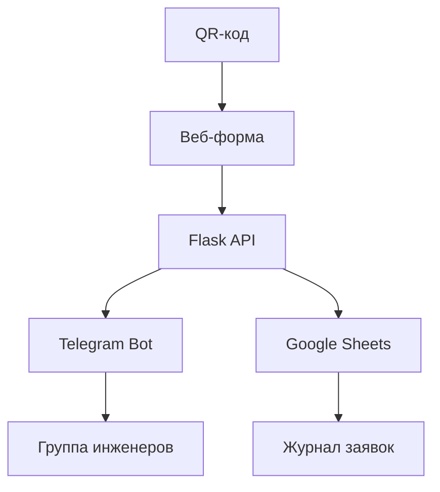

# 🔧 Система учета проблем в помещениях

Веб-система для учета и обработки заявок на обслуживание помещений с использованием QR-кодов, Telegram-бота и Google Sheets.

## ✨ Возможности

- 📱 **Веб-интерфейс** с формой выбора проблем
- 🔗 **QR-коды** для быстрого доступа к форме каждого помещения
- 🤖 **Telegram-бот** для уведомления инженеров
- 📊 **Google Sheets** для автоматического ведения журнала заявок
- 🏢 **Масштабируемость** для 100+ помещений
- 📱 **Адаптивный дизайн** для мобильных устройств

## 🚀 Быстрый старт

### 1. Установка зависимостей

```bash
pip install -r requirements.txt
```

### 2. Настройка Telegram-бота

```bash
python setup_telegram_bot.py
```

Следуйте инструкциям в скрипте:
- Создайте бота через @BotFather
- Получите токен бота
- Добавьте бота в группу инженеров
- Отправьте сообщение боту для получения chat_id

### 3. Настройка Google Sheets

```bash
python setup_google_sheets.py
```

Предварительно:
- Создайте проект в [Google Cloud Console](https://console.cloud.google.com/)
- Включите Google Sheets API и Google Drive API
- Создайте Service Account и скачайте JSON-ключи как `credentials.json`

### 4. Запуск приложения

```bash
python app.py
```

Приложение будет доступно по адресу: http://localhost:5000

## 📁 Структура проекта

```
.
├── app.py                    # Основное Flask приложение
├── requirements.txt          # Python зависимости
├── .env.example             # Пример конфигурации
├── setup_telegram_bot.py    # Настройка Telegram
├── setup_google_sheets.py   # Настройка Google Sheets
├── templates/
│   ├── room_form.html       # Форма заявки для помещения
│   └── admin_qr.html        # Генератор QR-кодов
├── static/
│   ├── css/                 # Стили
│   └── js/                  # JavaScript
└── README.md               # Документация
```

## ⚙️ Конфигурация

Создайте файл `.env` на основе `.env.example`:

```env
# Telegram Bot
TELEGRAM_BOT_TOKEN=your_bot_token_here
TELEGRAM_CHAT_ID=your_chat_id_here

# Google Sheets
GOOGLE_CREDENTIALS_FILE=credentials.json
GOOGLE_SHEET_ID=your_google_sheet_id_here

# Application
BASE_URL=https://your-domain.com
```

## 🔗 API Endpoints

### Основные страницы
- `GET /` - Главная страница
- `GET /room/<int:room_number>` - Форма заявки для помещения
- `GET /admin/qr_codes` - Генератор QR-кодов

### API
- `POST /api/submit_request` - Отправка заявки
- `GET /api/generate_qr/<int:room_number>` - Генерация QR-кода
- `GET /api/rooms` - Список помещений

## 📱 Использование

### Для пользователей

1. **Сканирование QR-кода**: Наведите камеру телефона на QR-код помещения
2. **Выбор проблемы**: Выберите тип проблемы из списка
3. **Описание**: При необходимости добавьте описание
4. **Отправка**: Нажмите "Отправить заявку"

### Для администраторов

1. **Генерация QR-кодов**: Откройте `/admin/qr_codes`
2. **Настройка параметров**: Укажите диапазон помещений и базовый URL
3. **Генерация**: Нажмите "Сгенерировать QR-коды"
4. **Печать**: Используйте функцию печати браузера или скачайте изображения

## 🏗️ Архитектура системы



### Компоненты

1. **Flask Web App** - основное веб-приложение
2. **Telegram Bot** - отправка уведомлений
3. **Google Sheets API** - ведение журнала
4. **QR Code Generator** - создание QR-кодов

## 🔧 Настройка для продакшена

### 1. Использование Gunicorn

```bash
gunicorn -w 4 -b 0.0.0.0:8000 app:app
```

### 2. Nginx конфигурация

```nginx
server {
    listen 80;
    server_name your-domain.com;

    location / {
        proxy_pass http://127.0.0.1:8000;
        proxy_set_header Host $host;
        proxy_set_header X-Real-IP $remote_addr;
    }
}
```

### 3. Systemd сервис

```ini
[Unit]
Description=Room Issues System
After=network.target

[Service]
User=www-data
Group=www-data
WorkingDirectory=/path/to/app
Environment=PATH=/path/to/venv/bin
ExecStart=/path/to/venv/bin/gunicorn -w 4 -b 127.0.0.1:8000 app:app
Restart=always

[Install]
WantedBy=multi-user.target
```

## 📊 Типы проблем

По умолчанию система поддерживает следующие типы проблем:

- 🧼 Закончилось мыло
- 🧻 Закончились бумажные принадлежности  
- 🗑️ Вынести мусор
- 🧽 Прибраться
- 🚰 Проблемы с сантехникой
- 💡 Проблемы с электричеством
- 🔥 Проблемы с отоплением
- 📝 Другая проблема

Типы проблем можно настроить в файле `app.py` в классе `Config`.

## 🏢 Типы помещений

Поддерживаемые типы помещений:

- WC - Туалет
- KITCHEN - Кухня  
- OFFICE - Офис
- MEETING - Переговорная
- STORAGE - Склад
- CORRIDOR - Коридор
- LOBBY - Холл

## 🔒 Безопасность

- Все данные передаются через HTTPS (в продакшене)
- Google Sheets API использует Service Account аутентификацию
- Telegram Bot API использует токен аутентификацию
- Валидация входных данных на стороне сервера

## 🐛 Устранение неполадок

### Telegram бот не отправляет сообщения

1. Проверьте правильность токена бота
2. Убедитесь, что бот добавлен в группу
3. Проверьте chat_id группы
4. Убедитесь, что у бота есть права на отправку сообщений

### Google Sheets не обновляется

1. Проверьте файл `credentials.json`
2. Убедитесь, что Service Account имеет доступ к таблице
3. Проверьте правильность GOOGLE_SHEET_ID
4. Убедитесь, что включены необходимые API

### QR-коды не генерируются

1. Проверьте правильность BASE_URL
2. Убедитесь, что установлена библиотека qrcode[pil]
3. Проверьте доступность интернета для генерации

## 📈 Масштабирование

Для работы с большим количеством помещений (100+):

1. **База данных**: Рассмотрите использование PostgreSQL вместо Google Sheets
2. **Кэширование**: Добавьте Redis для кэширования QR-кодов
3. **Очереди**: Используйте Celery для асинхронной обработки заявок
4. **Мониторинг**: Добавьте логирование и мониторинг

## 🤝 Вклад в проект

1. Форкните репозиторий
2. Создайте ветку для новой функции
3. Внесите изменения
4. Создайте Pull Request

## 📄 Лицензия

MIT License - см. файл LICENSE

## 📞 Поддержка

Если у вас возникли вопросы или проблемы:

1. Проверьте раздел "Устранение неполадок"
2. Создайте Issue в репозитории
3. Опишите проблему с подробностями и логами

---

**Разработано для эффективного управления заявками на обслуживание помещений** 🏢✨